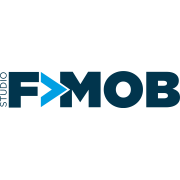

# NodeSchool Campinas

Capítulo campineiro do NodeSchool. Visite o nosso site para mais informações: http://nodeschool.io/campinas/

## 1º NodeSchool Campinas

O nosso primeiro meetup foi realizado no dia 31/07/2015. Agradecimentos especiais a @princiweb pela infraestrutura e pelo coffee break para realização do evento.

Fotos do evento: www.meetup.com/Nodeschool-Campinas/photos/26306043/

Meetup: http://www.meetup.com/Nodeschool-Campinas/

## Bate Papo

## Equipe

* Organizadores:
   * **Filipe Oliveira:** GitHub: [@fmoliveira](https://github.com/fmoliveira), Twitter: [@tfmoliveira](https://twitter.com/tfmoliveira)
   * **Rodrigo Rocha:** GitHub: [@MiattoRocha](https://github.com/MiattoRocha), Twitter: [@RodRocha20](https://twitter.com/RodRocha20)
   * **Éderson Nascimento:** GitHub: [@edersonnascimento](https://github.com/edersonnascimento)
   * **Felipe Mattos:** GitHub: [@IAMFELIPEMATTOS](https://github.com/IAMFELIPEMATTOS), Twitter: [@IAMFELIPEMATTOS](https://twitter.com/IAMFELIPEMATTOS)
   * **Bruno Belarmino:** GitHub: [@brunobelarmino](https://github.com/brunobelarmino), Twitter: [@brbelarmino](https://twitter.com/brbelarmino)
   * **Bruno Panuto:** GitHub: [@nubunto](https://github.com/nubunto)
   * **Rodolfo Pereira:** GitHub: [@rodolfoprr](https://github.com/rodolfoprr), Twitter: [@rodolfoprr](https://twitter.com/rodolfoprr)

## Patrocinadores

